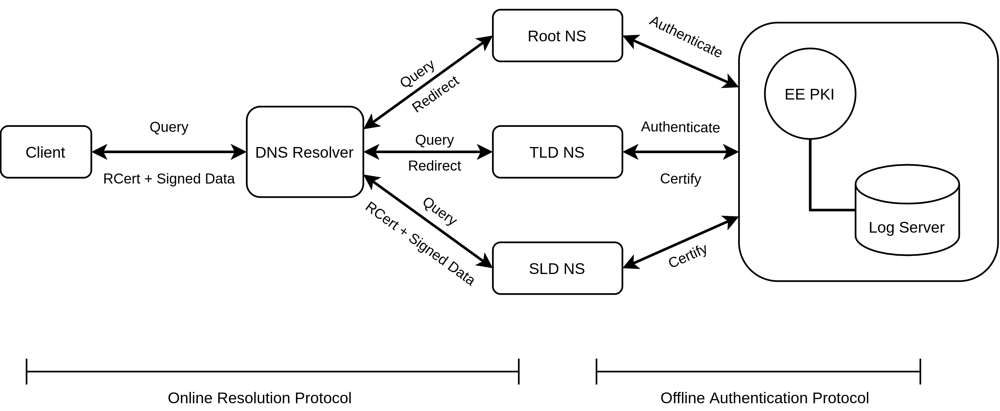
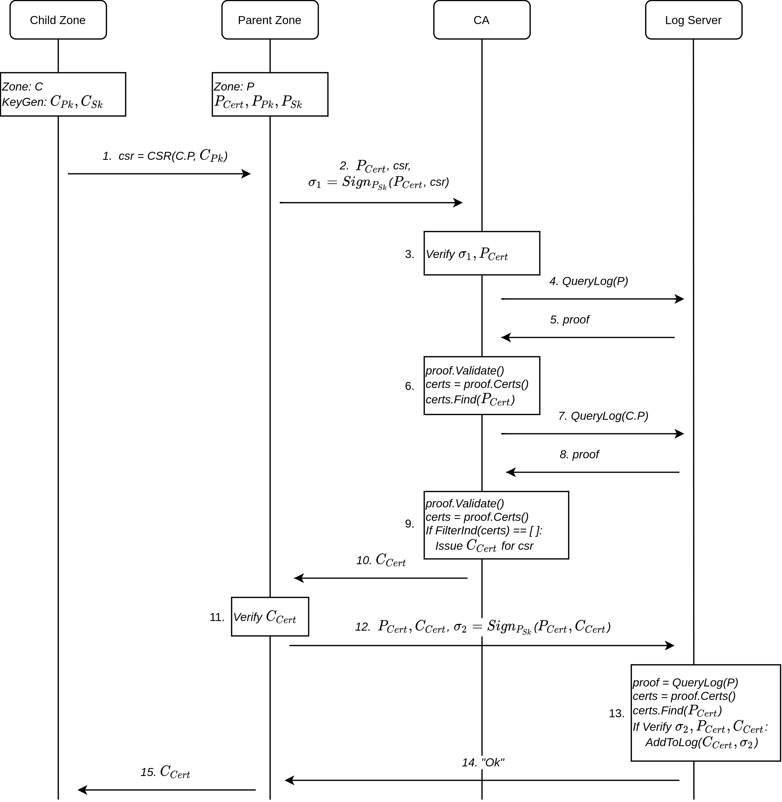
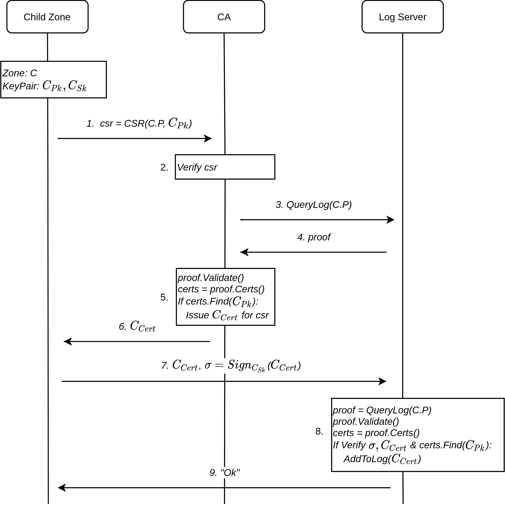
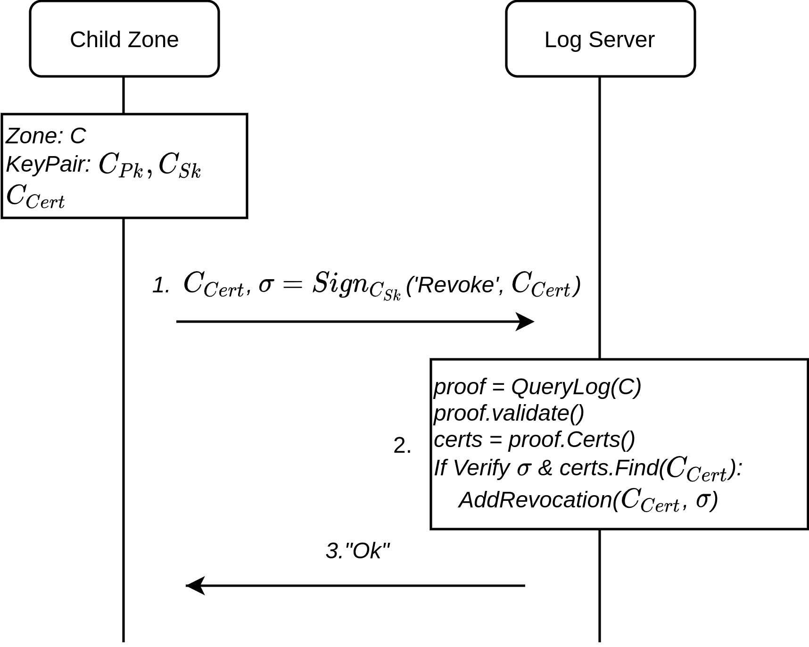
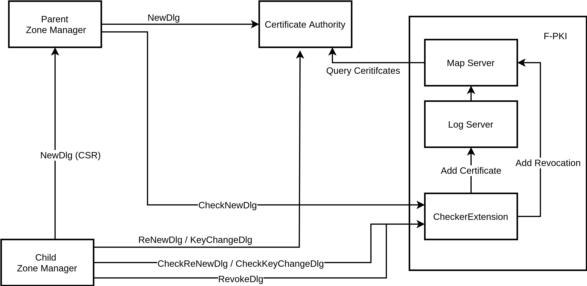

# A New Authentication Architecture for Naming Systems

This document provides an overview of an experimental authentication architecture for Internet naming systems.

Unlike DNSSEC-style authentication that establishes a chain of trust solely within the DNS hierarchy, the new architecture introduces external trust entities, i.e., CAs in an end-entity PKI (EE-PKI), to authenticate zone authorities. This creates unique opportunities to overcome the inherent limitations of DNSSEC in terms of security, management, and performance.

A prototype of the new design has been implemented and integrated into the RAINS codebase.

### Table of Contents
1. [Problem Statement](#sec-problem)
2. [Design Rationale](#sec-design)
3. [Protocols](#sec-protocol)
4. [Formal Model and Verification](#sec-formal)
5. [Prototype Implementation](#sec-prototype)

## Problem Statement

### Drawbacks of DNSSEC

Serving authentic data is the most fundamental security requirement for a naming system. DNSSEC allows zone owners to sign their DNS records and resolvers to verify the authenticity of received records. However, DNSSEC comes with several major drawbacks:

- **Fragile trust model**. A validator must trust each level of delegation in order to verify the signed records. Any corrupted zone on the chain of trust can trick the validator to accept bogus data. When it comes to security, DNS authorities are not as prudent as professional service providers such as CAs: empirical studies show that many DNSSEC-signed zones use weak keys and algorithms [[Shulman2017]](#Shulman2017), and even the same key across multiple zones [[Chung2017]](#Chung2017). THe compromise of a zone implies the control of all its subzones, and the single root key embodies a kill switch that could potentially bring down the entire Internet [[Ben2017]](#Ben2017).

- **High operational complexity**. DNSSEC imposes stringent consistency requirements on the authentication chain. Any inconsistency (e.g., missing or mismatching keys, signatures, algorithms, or security parameters) will fail the validation and name resolution. Such complexity with numerous corner cases to handle has caused endless implementation bugs and configuration errors, which in turn lead to frequent (and sometimes large-scale) outages at different levels of the DNS hierarchy (including the root and many TLDs)&mdash;a nightmare to every DNS practitioner [[IANIX]](#IANIX). This explains the generally perceived reluctance to deploy DNSSEC and why the adoption rate has remained unsatisfying over the years.

- **Large performance overhead**. DNSSEC records (e.g., DNSKEY, RRSIG) are generally larger than regular records and require much more resources to process. It is estimated that, with failure cases taken into account, DNSSEC-enabled zones should prepare themselves to handle 10 times the query load and 100 times the response load of their unsigned counterparts [[Geoff2013]](#Geoff2013). A validating resolver must retrieve (if not cached) and process the entire signature chain up to the trust anchor, the cost of which might even surpass that of establishing a TLS connection. The large performance overhead also increases the risk of DoS attacks, which have already been reported in reality [[Akamai]](#Akamai). 

- **Lack of end-to-end (E2E) authentication**. As a result of the concerns above (especially the 2nd and 3rd aspect), end-users (stub resolvers) almost never validate DNSSEC-signed records in practice. They should rely on validating (recursive) resolvers to verify DNS data at best. However, DNS interception is known to be prevalent [[Liu2018]](#Liu2018), rendering the entire authentication mechanism meaningless to end users.

We argue that these drawbacks are intrinsic to DNSSEC and they cannot be circumvented without radical architectural changes.

### The Baseline RAINS

RAINS was not originally designed to address the problems discussed above. The baseline RAINS essentially follows the same security architecture as DNSSEC, except the replacement of the single global root key with per-ISD root key [[SCION2017]](#SCION2017); thus, it suffers from the same set of drawbacks. This motivates us to revisit the authentication architecture of naming systems through a modern lens and to take a principled approach in designing a more robust and performant solution.

In addition, the baseline RAINS made some design choices that we find under-optimal in retrospect. For example, RAINS treats referral data&mdash;`Redirection` (equivalent to DNS `NS` record)&mdash;as a type of `Assertion` and signs it in the residing zone. However, referral records at a zone cut should not be authoritative; signing `Redirection` offers no additional security but increases validation costs and blurs the boundary of zone authorities. We will thus also refine RAINS's data model to accommodate our new authentication architecture.

### Our Design Goals

1. **Robust security architecture**. The authority and security of a zone should not unconditionally hinge on any other entity including its parent and third parties. We aim at a robust system of *checks and balances* where no single entity can exert unlimited power over the namespace and take over a zone without the consent from its owner.

2. **Resistance to operational errors**. Once securely delegated, a zone should be able to manage its keys and serve authenticated data independently from the parent zone. This avoids the synchronization along the delegation chain with strict consistency requirements imposed by DNSSEC, minimizing operational errors.

3. **Efficient E2E authentication**. End users should be encouraged and enabled to validate, on their own, that the received data originates from the genuine zone authority and remains intact. The validation should use preferably well-established trust anchors (e.g., CA trust stores shipped with OSes or browsers) and be as efficient as possible.

## Design Rationale

Our key insight is to separate the authentication of *zone authority* and the authentication of actual *zone data*. They are treated equally in DNSSEC and both performed by a validator during the *online* resolution process. Instead, we can outsource the former process to some external authority, along with the management complexity and performance overhead, and have it completed in an *offline* manner. In particular, we use an EE-PKI (hereafter, assumed to be the Web PKI) to authenticate and certify the ownership/authority of a zone. Each zone now has its RAINS Certificate (RCert) that can be used to sign zone data. This allows end users who already rely on the EE-PKI to easily validate name-resolution answers, without going through the fragile and potentially lengthy DNSSEC-style authentication chain. The figure below depicts an overview of this new architecture.

It is easy to see that the design can achieve our 2nd and 3rd goal. Yet, the introduction of trusted third parties complicates the design for the 1st goal with both challenges and opportunities. We should account for different entities that may be corrupted.

### Malicious CA

The conventional trust model of the Web PKI is oligopoly, meaning (loosely) that any CA can issue a certificate for any domain. It would be catastrophic if our architecture allows a malicious CA to hijack arbitrary zones by issuing RCerts at will. We prevent this by reusing existing CT log infrastructure and engaging a public logger to actively verify an RCert before including it to the log. In particular, the validation consists in checking whether the RCert of zone is approved by the parent zone, which is supposed to be the legitimate owner of the child zone before the secure delegation is established. The absence of the parent's consent indicates a malicious logging attempt (by a CA) and the RCert should be rejected by the logger. By enforcing the acceptance of only logged RCerts at end users (which is already the case for regular TLS certificates), we can effectively prevent the misissuance of valid and usable RCerts. Note that special care must be taken for the top of the name hierarchy due to security and compatibility reasons.

### Malicious DNS authority

In DNSSEC, a zone has the ultimate control over all its subzones through the manipulation of (zone) signing keys. Hence, the compromise of the root key or TLD keys will be disastrous. It is desirable to keep a zone secure even if the superordinate zones are compromised. Our architecture for the first time enables one to achieve this challenging goal. First, we can thwart a malicious parent's attempt to obtain RCerts for an already delegated child zone by having CAs and loggers check the existence of RCerts: if a valid RCert for the child zone exists, any certificate issuance request should be rejected (unless it is a renewal request from the child zone itself within the validity period of the delegation). This requires a comprehensive view of all RCerts to be public available. Second, we can set constraints for an RCert so that it can only be used to sign data for the associated zone but not its subzones. With these mechanisms in place, a corrupted zone can at most compromise the availability but not the authenticity of the subzones.

### Trusted Log

We currently assume a trusted log that can provide a comprehensive view of all RCerts. The abstraction can be instantiated by a recent PKI proposal [[Laurent2022]](#Laurent2022) (also see the [implementation section](#sec-prototype)). Note that even if the logger is compromised, it cannot issue an RCert alone and so there is no direct harm to the zone. The relaxation of the assumption is left for future work.

## Protocols

We have designed a set of protocols for the issuance and management of RCerts. The protocols are regarded as *offline* because they are executed only infrequently and independently of the name resolution process. The protocols run between a child zone (owner), a parent zone (owner), an CA, and a log server. Below we briefly introduce the most important protocols.

### Initial Delegation

The NewDlg protocol is used when a zone is delegated for the first time. The parent zone requests an RCert on behalf of the child zone, by proving to the CA and log server that it indeed has the necessary authority.

### Certificate Update

Once a zone has obtained its own RCert, it can manage the RCert without the need for the parent zone. The zone can renew the RCert (with the same key) directly at the CA and then add it to the log server. If the zone wants to change the public key associated with its RCert, it should follow a slightly different protocol.

### Certificate Revocation

There is also a built-in certificate revocation protocol. Note that since the log server in our design stores the revocation status for RCerts, there should be a request for a certificate owner to revoke it directly at the log server.

## Formal Model and Verification

The design of security protocols that meet expected properties is notoriously difficult, because of the complex interactions between parties and rapid exploration of state spaces that cannot be exhausted by hand. To this end, we formally modeled the NewDlg protocol (the most important among all) with a state-of-the-art theorem prover, [Tamarin](https://tamarin-prover.github.io), and successfully verified the claimed security properties. Unsurprisingly, the co-design with a formal model did help us identify latent flaws in our early hand-crafted protocol, e.g., the lack of necessary certificate verification by the parent zone. 

Note that the modeling and verification of such a protocol already require a significant amount of effort, as also suggested by the design of similar protocols (e.g., the certificate registration process in [[ARPKI]](#ARPKI). The formal analysis of all protocols pertinent to our authentication architecture goes beyond the scope of this project, and we leave this for future work.

Please refer to [this note](tamarin/README.md) for more detail.

## Prototype Implementation

We implemented a working prototype for the new authentication architecture. It consists of an online part, which enables E2E authentication of RAINS assertions with RCerts, and an offline part, which implements the above-mentioned RCert issuance and management protocols.

### Online Name Resolution with E2E Authentication 

Since enabling the promsied E2E authentication in RAINS requires significant changes (refactoring of data model, caching mechanism, validation logic, etc.) and the current codebase is not yet stable, we postpone the support of E2E data validation during name resolution to [Task 3](https://github.com/netsys-lab/scion-rains#task-3-make-use-of-drkey-system-to-develop-mechanisms-for-secure-and-highly-available-rains-communication), which may be realized in a new codebase.

### Offline Protocols

The offline part of our prototype consists of zone managers for child and parent zones to manage RCerts, a CA server, and a logging infrastructure. The implementation is independent from the existing RAINS codebase. Please refer to this [manual](https://github.com/netsys-lab/scion-rains/tree/master/offlineauth) for the use and test of these tools. Below is an architectural overview of the prototype:

#### Zone Manager 

The command line programs for RCert management are similar to those implementing the ACME protocol for TLS certificates, e.g., 'certbot'. The programs take in necessary arguments and send requests to the CA and/or Checker Extension.

For example, a child zone can generate a CSR for its parent zone to use for a NewDlg request:

    $ ./ChildZoneManager NewDlg Ed25519 path/to/key.pem --zone ethz.ch

This creates a file `ethz.ch_csr.pem` which is then used by the parent zone to obtain a certificate for the child zone:

    $ ./ParentZoneManager path/to/config.conf --NewDlg ethz.ch_csr.pem --IndSubZone=true
    
In this example the parent zone would need to be `ch`.

Once the child zone has its certificate, it can use the program to renew or revoke it (or whatever update operations supported):

    $ ./ChildZoneManager ReNewDlg Ed25519 path/to/key.pem path/to/cert.pem
    $ ./ChildZoneManager RevokeDlg Ed25519 path/to/key.pem path/to/cert.pem

Here the existing certificate is taken as input besides the keys. The program will then create a new CSR based on the existing certificate.

Note that keys can be generated with a small key manager program that is also part of the codebase.

#### Logging Infrastructure

We adapt the logging infrastructure of the [F-PKI project](#Laurent2022) into our prototype. F-PKI uses a log server to store certificates in an Merkle Hash Tree (MHT), similar CT logs, and additionally a map server that provides a key-value mapping from domains to associated certificates in a sparse MHT. These components can be run as docker containers [13]. We use F-PKI client-side code to query the map-server and add certificates to the log-server.

For the additional security checks that the log server envisioned in our design has to perform, we implement a so-called Checker Extension. The idea is to run the Checker Extension as an additional server or container, working as a reverse-proxy for the log server, since certificates should only be added after having the required checks performed.

Therefore, the log server should only be accessible from the Checker Extension. This can be realized by having the Checker Extension run in a separate container and not exposing the log server to the external network. The map server, on the other hand, should be accessible for anyone to query all certificates (and revocations) for a specific zone.

The Checker Extension handles certificate issuance requests from the parent-zone manager program and requests to update certificates from the certificate owner directly via the child-zone manager program.

#### Servers and APIs

We implement both the Checker Extension and the CA as http(s) servers providing APIs with Content-Type `application/json`. Currently the servers only run http, but https should be used for deployment. 

The following API endpoints are then provided by the CA and the Checker Extension server:

    POST https://<CA_Address>/NewDlg
    POST https://<CA_Address>/ReNewDlg
    POST https://<CA_Address>/KeyChangeDlg
    POST https://<CheckerExtension_Address>/CheckNewDlg
    POST https://<CheckerExtension_Address>/CheckReNewDlg
    POST https://<CheckerExtension_Address>/CheckKeyChangeDlg
    POST https://<CheckerExtension_Address>/RevokeDlg

#### Communication and Message Format

All requests are implemented as structs in Go and encoded with JSON, a common format for web applications and also used in ACME. Binary data like certificates, certificate signing requests, keys and signatures is base64 encoded in these requests. 

The responses are also encoded as JSON objects. They only contain an error/status field and in case of the CA response also a certificate field which is populated with the base64 encoded certificate if the issuance was allowed.

The communication model in our prototype implementation is blocking. This was chosen to keep the prototype simple and is certainly not ideal for scalability, since clients are waiting while the server is processing the request. The design and implementation of a non-blocking or asynchronous model is left for future work.

#### Crypto Primitives

The prototype supports two key signature schemes: RSA-PSS and Ed25519. The algorithm can be specified when running the child-zone manager program (see above).

#### RCert Format

The RCerts are X.509v3 certificates. An example is shown below:

    Certificate:
    Data:
        Version: 3 (0x2)
        Serial Number: 123 (0x7b)
        Signature Algorithm: ED25519
        Issuer: CN = RHINE EXAMPLE CA
        Validity
            Not Before: Dec 27 02:08:02 2021 GMT
            Not After : Dec 18 02:08:02 2022 GMT
        Subject: CN = RHINE:example.ch
        Subject Public Key Info:
            Public Key Algorithm: ED25519
                ED25519 Public-Key:
                pub:
                    de:c7:27:27:85:40:b2:7e:32:7a:43:30:22:ff:64:
                    68:32:8b:cb:f6:08:e7:20:3e:a0:b9:2c:f2:c9:06:
                    6c:82
        X509v3 extensions:
            X509v3 Key Usage: critical
                Digital Signature
            X509v3 Basic Constraints: critical
                CA:FALSE
            X509v3 Authority Key Identifier: 
                keyid:83:BF:BA:CE:5E:A9:01:78:92:14:09:9D:12:D8:18:ED:FC:8C:F7:48
            X509v3 Subject Alternative Name:
                DNS:example.ch
    Signature Algorithm: ED25519
         91:4a:86:86:ca:eb:aa:76:3c:7f:08:89:a2:5d:85:84:ad:f6:
         ed:88:2b:fa:f0:40:ab:1b:46:a9:36:f9:ff:08:11:a3:b0:46:
         38:dd:d3:ac:94:a1:a0:32:9c:41:1d:8a:48:2a:28:08:e3:c1:
         2c:db:1e:05:d4:77:b7:a6:3f:04

## References

<a id="Shulman2017">[Shulman2017]</a> 
Haya Shulman and Michael Waidner. One key to sign them all consid- ered vulnerable: Evaluation of DNSSEC in the internet. In *Proceedings of the USENIX NSDI*, 2017.

<a id="Chung2017">[Chung2017]</a> 
Taejoong Chung, Roland van Rijswijk-Deij, Balakrishnan Chan- drasekaran, David Choffnes, Dave Levin, Bruce M. Maggs, Alan Mislove, and Christo Wilson. A longitudinal, End-to-End view of the DNSSEC ecosystem. In *Proceedings of the USENIX Security*, 2017.

<a id="Ben2017">[Ben2017]</a> 
Benjamin Rothenberger, Daniele E. Asoni, David Barrera, and Adrian Perrig. Internet kill switches demystified. In *Proceedings of EuroSec*, 2017.

<a id="IANIX">[IANIX]</a>
Major dnssec outages and validation failures. <https://ianix.com/pub/dnssec-outages.html>.

<a id="Geoff2013">[Geoff2013]</a>
Geoff Huston. Measuring dnssec performance. <https://labs.apnic.net>, 2013.

<a id="Akamai">[Akamai]</a>
Dnssec targeted in dns reflection, amplification ddos attacks. <https://community.akamai.com/>, February 2016.

<a id="Liu2018">[Liu2018]</a>
Baojun Liu, Chaoyi Lu, Hai-Xin Duan, Ying Liu, Zhou Li, Shuang Hao, Min Yang. Who Is Answering My Queries: Understanding and Characterizing Interception of the DNS Resolution Path. In *Proceedings of the USENIX Security*, 2018.

<a id="SCION2017">[SCION2017]</a>
A. Perrig, P. Szalachowski, R. M. Reischuk, and L. Chuat. 2017. SCION: A Secure Internet Architecture. Springer Verlag.

<a id="ARPKI">[ARPKI]</a>
David A. Basin, Cas Cremers, Tiffany Hyun-Jin Kim, Adrian Perrig, Ralf Sasse, Pawel Szalachowski: ARPKI: Attack Resilient Public-Key Infrastructure. In *Proceedings of ACM CCS*, 2014.

<a id="Laurent2022">[Laurent2022]</a>
Laurent Chuat, Cyrill Krähenbühl, Prateek Mittal, Adrian Perrig. F-PKI: Enabling Innovation and Trust Flexibility in the HTTPS Public-Key Infrastructure. In *Proceedings of NDSS*, 2022.

<a id="Wouters2021">[Wouters2021]</a>
Paul Wouters and Wes Hardaker. The DELEGATION_ONLY DNSKEY flag. Internet-Draft draft-ietf-dnsop-delegation-only-02, Internet En- gineering Task Force, 2021.
